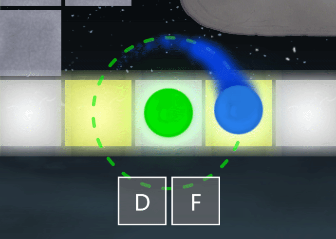
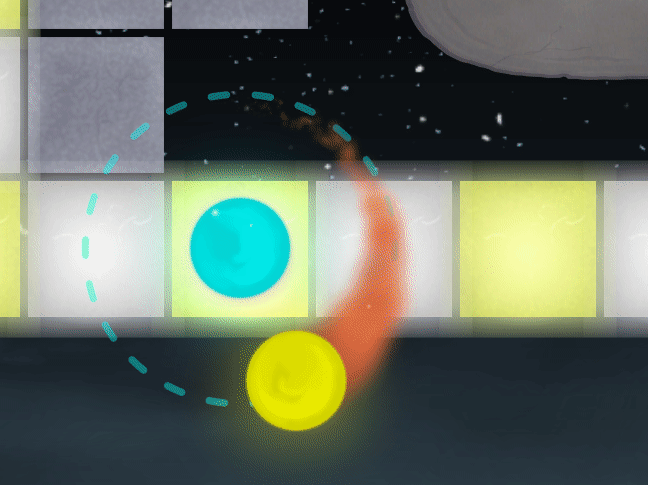
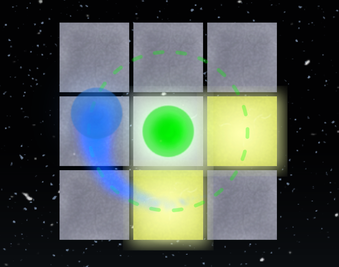

# [Click here to download the latest version](https://github.com/PizzaLovers007/AdofaiTweaks/releases)

# AdofaiTweaks

General tweaks for the rhythm game
[A Dance of Fire and Ice](https://store.steampowered.com/app/977950/A_Dance_of_Fire_and_Ice/).

Join the ADOFAI.gg community discord! https://discord.gg/TKdpbUUfUa

## Available Tweaks

* **Disable Effects** - Disables certain effects to improve performance.
* **Hide UI Elements** - Hides certain UI elements (Beta Build text, Otto,
   judgment text, etc.).
* **Judgment Visuals** - Improves the visuals of judgments.
    * Includes a hit error meter
* **Key Limiter** - Limits which keys count as inputs.
* **Key Viewer** - Shows a key viewer for registered keys.
* **Planet Color** - Sets the color of the planets and their tail individually.
* **Planet Opacity** - Sets the opacity of the planets individually.
* **Restrict Judgments** - Changes behavior of certain judgments.
    * Kill player on restricted judgment
    * Instantly restart the level on restricted judgment
    * Do not register restricted judgment on hit
* **Miscellaneous**
    * Disable screen flip in "Glitch" filter
    * Disable editor zoom in/out when in gameplay

## Supported Languages

* English
* 한국어 (Provided by [CrackThrough](https://github.com/CrackThrough) & [NoBrain0917](https://github.com/NoBrain0917))
* Español (Provided by
    [Econ](https://www.youtube.com/channel/UCE7Kv2xKmB_pLnBV0VBrNYA))
* Polski (Provided by crispy)
* Français (Provided by Woopie 2)
* Tiếng Việt (Provided by Gesomaru)
* 中文（简体）(Provided by Gunbuster)
* Русский (Provided by fallen and the Russian ADOFAI community https://discord.gg/vrknbRPaSr)

## Images

Key Limiter:

Planet Color:

Planet Opacity:

## Installation

[Video tutorial for a different mod](https://youtu.be/v60FdewWjY8) (thanks
Econ!)

1. [Install UnityModManager](https://www.nexusmods.com/site/mods/21).
1. Download the latest `AdofaiTweaks-x.x.x.zip` file from the
   [Releases](https://github.com/PizzaLovers007/AdofaiTweaks/releases) page.
1. Open UnityModManager.
1. Drag and drop the zip file into the "**Drop zip files here**" area.
1. Launch the game.

## Usage

The settings for each tweak are available through UnityModManager's settings,
which you can open by pressing **Ctrl+F10**.
