# Custom Unity Asset Bundles for ADOFAI

Unity Asset Bundles are extremely useful for importing images, sounds, fonts, or more into your mod. This guide will show a step-by-step process to create the bundle and use it in the mod.

## Setting up a Unity project

You **must** use Unity 2019.3.0f6 (or any 2019.3.x equivalent).

### 1. Create a new empty project

Template choice doesn't really matter, but Universal Project Template works fine.

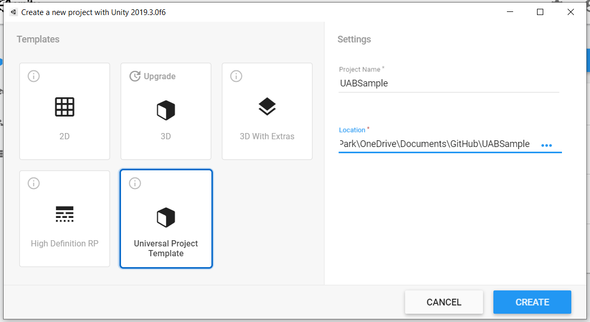

### 2. Create a new folder named after your mod

In this image, I named it "MyAdofaiMod".

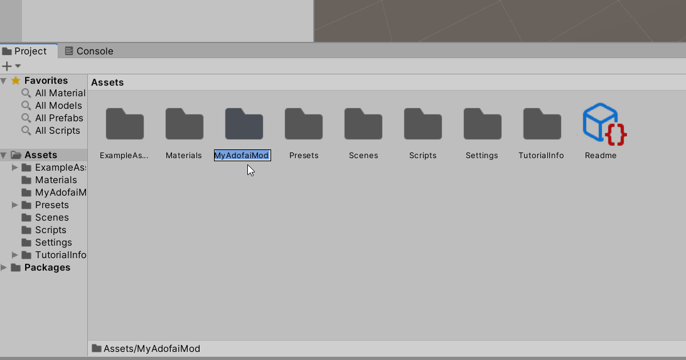

### 3. Open the folder and drag-and-drop any files you want to load into the mod

Images may look weird, but we will adjust the settings in the next step. In this example, I have 5 images and 2 fonts.

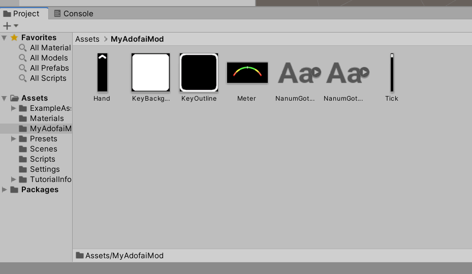

### 4. Adjust the file import settings

Most files don't need any adjustments, but the default import settings for **images** are a bit bad.

When you click on an image, the panel on the right side will show some info. Set these settings and hit "Apply" in the bottom right.

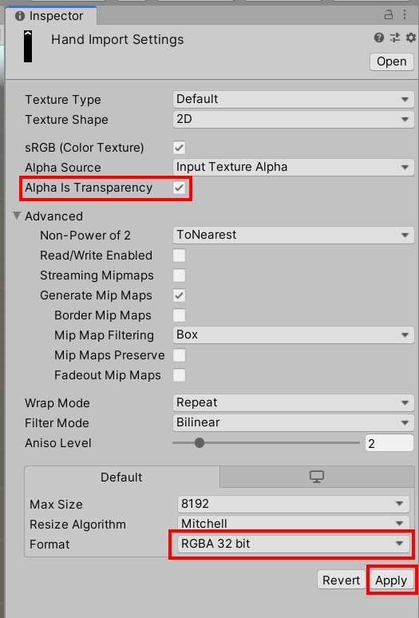

Make sure this is set for **all** images.

This is what it should look like after you set all the settings properly:

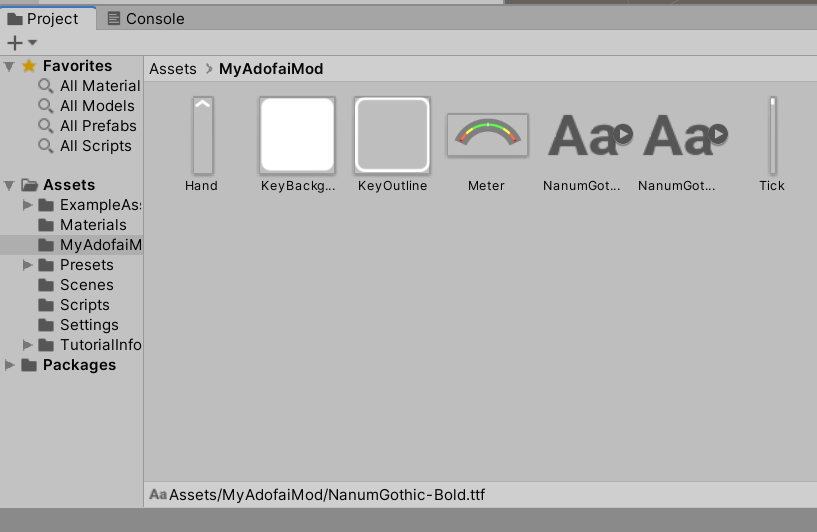

Note that I only tested this with images and fonts, so you may need to adjust settings for sound files.

## Creating the asset bundle

### 1. Create the asset bundle script

You need to create an `Editor` folder in the `Assets` folder. Right click on `Assets` > Create > Folder > name it `Editor`.

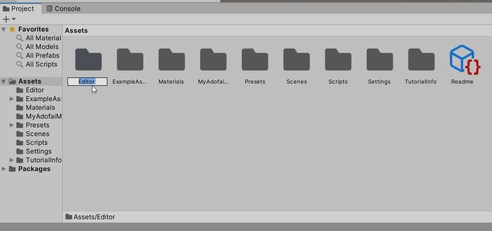

In this folder, create a new C# Script names `CreateAssetBundles`.

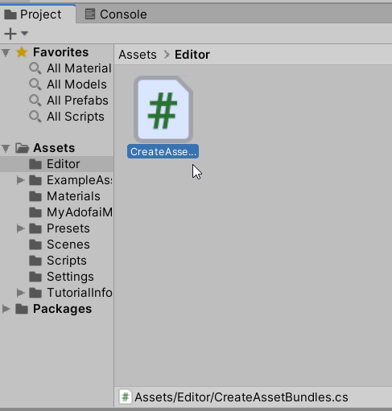

Open the script and replace everything inside with the code below:

```cs
using UnityEditor;
using System.IO;

public class CreateAssetBundles
{
    [MenuItem("Assets/Build AssetBundles")]
    static void BuildAllAssetBundles()
    {
        string assetBundleDirectory = "Assets/AssetBundles";
        if(!Directory.Exists(assetBundleDirectory))
        {
            Directory.CreateDirectory(assetBundleDirectory);
        }
        BuildPipeline.BuildAssetBundles(assetBundleDirectory, 
                                        BuildAssetBundleOptions.None, 
                                        BuildTarget.StandaloneWindows);
    }
}
```

### 2. Add the files to the asset bundle

Now go back to your files you want to include in the mod. If you click on any of them, notice at the bottom there's a menu called `AssetBundle`. Click on the middle dropdown menu and select `New...`.

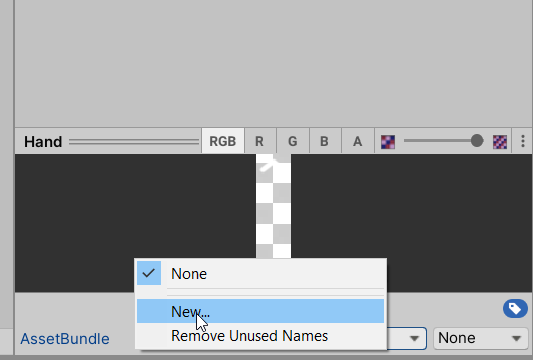

Name your bundle with **lowercase letters and underscores**. For this example, I named it `my_adofai_mod`.

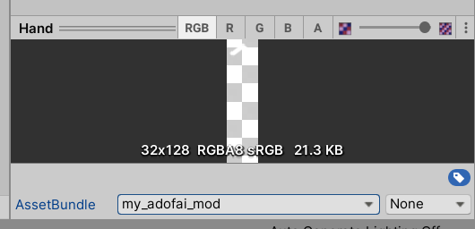

Select this new option `my_adofai_mod` (or whatever name you chose) for **every** file that you want to include.

### 3. Build the bundle

Now that you have the files included in the bundle, it's time to build it! In the top menu, select Assets > Build AssetBundles.

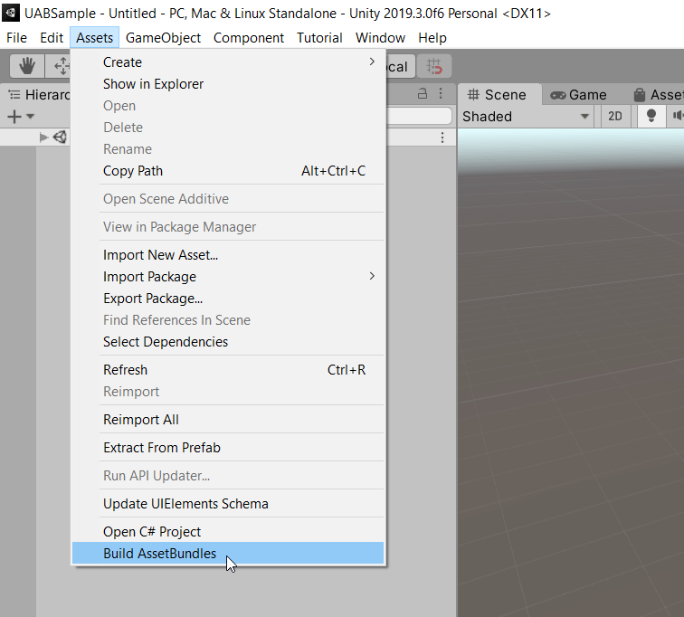

This should create an `AssetBundles` folder with your `my_adofai_mod` asset bundle inside of it.

## Using the asset bundle in your mod

Using the asset bundle is very simple. You can create a class called `MyAdofaiModAssets` and have static properties that access certain files in the asset bundle:

```cs
public static class MyAdofaiModAssets
{
    public static Font NanumGothicFont { get; private set; }
    public static Sprite MeterSprite { get; private set; }

    private static readonly AssetBundle assets;

    static TweakAssets() {
        // Replace the path here with the path to your mod
        assets =
            AssetBundle.LoadFromFile(
                Path.Combine("Mods", "MyAdofaiMod", "my_adofai_mod"));
        NanumGothicFont = assets.LoadAsset<Font>("Assets/NanumGothic-Regular.ttf");
        MeterSprite = assets.LoadAsset<Sprite>("Assets/Meter.png");
    }
}
```

You can add `MyAdofaiModAssets.MeterSprite` and `MyAdofaiModAssets.NanumGothicFont` to your code to access these assets at any time.

## Packaging the asset bundle with your mod

You **must** include the asset bundle file in your .zip installation for your mod to load the assets correctly. First, copy the file here:

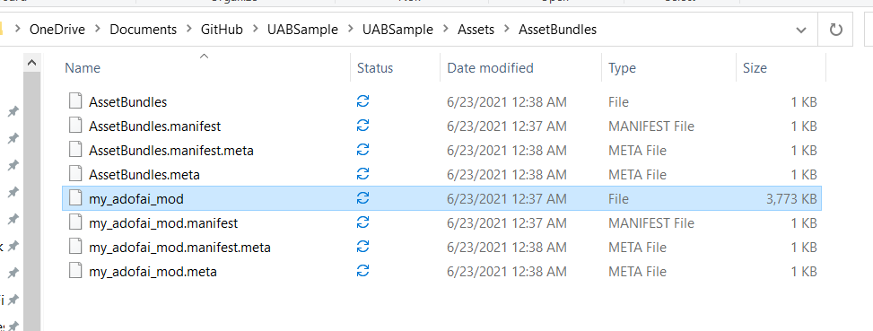

Then paste it in your temporary installation folder before you zip up the mod.

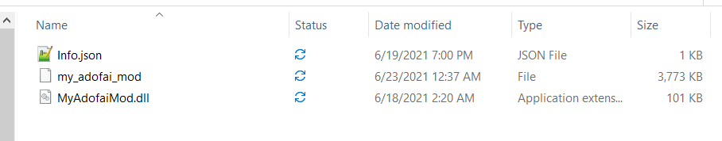

That's it!