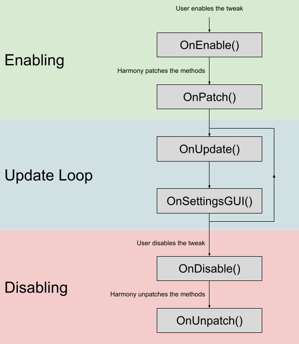

# Tweak Lifecycle

This page will describe the general flow of tweak execution as well as provide some examples on how each of the lifecycle methods can be used.

## Lifecycle methods

### `OnEnable()`

* Called when the user enables the tweak and **before** Harmony patches the methods for your tweak.
* Use this to perform any necessary setup for your tweak in general and/or for your patches.
  * Example: The hit error meter gameobject is added to the world here.

### `OnPatch()`

* Called **after** Harmony patches the methods for your tweak.
* Use this to trigger any additional setup after the patches are added.
  * Example: Planet Color and Planet Opacity update the colors/opacities of the planets by calling the newly patched "set color" methods.

### `OnUpdate()`

* Called when the game updates **every frame**.
* Use this to update any elements visible on the screen.
  * Example: Key Limiter and Key Viewer check for any pressed keys when editing the registered keys.

### `OnSettingsGUI()`

* Called when the AdofaiTweaks settings GUI is visible **every frame**.
* Use this to display GUI elements and update your tweak's settings.
* **The settings GUI can only be updated from this method.**

### `OnDisable()`

* Called when the user disables the tweak and **before** Harmony unpatches the methods for your tweak.
* Use this to clean up any gameobjects that your tweak added or run any last-minute patched methods.
  * Example: The hit error meter and key viewer gameobjects are destroyed here.

### `OnUnpatch()`

* Called **after** Harmony unpatches the methods for your tweak.
* Use this to have any additional cleanup after the patches are removed.
  * Example: Planet Color and Planet Opacity use this to reset the colors/opacities back to the game's vanilla appearance.

## Other methods

### `OnHideGUI()`

* Called when the user hides UMM's settings GUI.
* Use this reset any state that you don't want to be in when the settings are closed.
  * Example: Key Limiter and Key Viewer tweaks stop editing the keys.

### `OnLanguageChange()`

* Called when the user changes the language for AdofaiTweaks.
* Use this to update any visible text that your tweak adds.